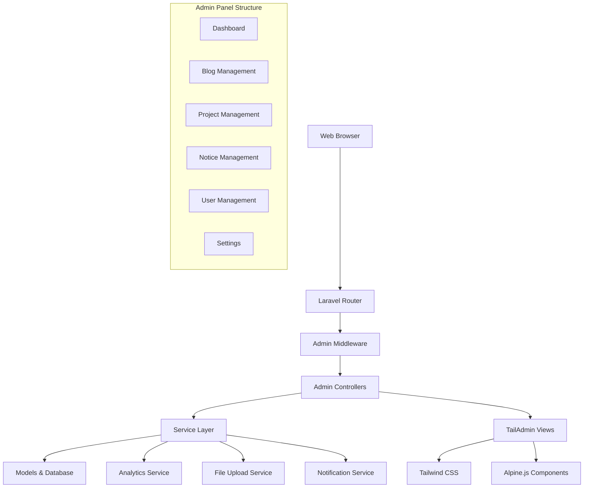

# Admin Dashboard Integration Design

## Overview

This design document outlines the integration of the TailAdmin free Tailwind dashboard template into the existing Laravel application. The solution will create a comprehensive admin panel with CRUD operations for all content types and a statistics dashboard, while maintaining security and following Laravel best practices.

## Architecture

### High-Level Architecture

### Route Structure

The admin panel will be organized under the `/admin` prefix with the following route structure:

- `/admin` - Dashboard with statistics
- `/admin/blogs` - Blog CRUD operations
- `/admin/projects` - Project CRUD operations  
- `/admin/notices` - Notice CRUD operations
- `/admin/users` - User management
- `/admin/settings` - System settings

### Middleware Stack

1. **web** - Standard Laravel web middleware
2. **auth** - Ensure user is authenticated
3. **admin** - Custom middleware to verify admin permissions
4. **throttle** - Rate limiting for admin actions

## Components and Interfaces

### 1. Admin Layout Component

**Purpose**: Base layout template integrating TailAdmin design
**Location**: `resources/views/admin/layouts/app.blade.php`

**Key Features**:
- Responsive sidebar navigation
- Top header with user profile dropdown
- Breadcrumb navigation
- Flash message display area
- Mobile-responsive hamburger menu

### 2. Dashboard Controller

**Purpose**: Handle dashboard statistics and overview
**Location**: `app/Http/Controllers/Admin/DashboardController.php`

**Methods**:
- `index()` - Display dashboard with statistics
- `getStats()` - API endpoint for real-time stats

**Statistics to Display**:
- Total counts (blogs, projects, notices, users)
- Monthly content creation trends
- Recent activity feed
- Content status distribution
- Top performing content

### 3. Resource Controllers

Each content type will have a dedicated resource controller following Laravel conventions:

#### BlogController
**Location**: `app/Http/Controllers/Admin/BlogController.php`
- `index()` - List blogs with pagination, search, filters
- `create()` - Show create form
- `store()` - Handle blog creation
- `show()` - Display single blog (optional)
- `edit()` - Show edit form
- `update()` - Handle blog updates
- `destroy()` - Soft delete blog
- `bulkAction()` - Handle bulk operations

#### ProjectController
**Location**: `app/Http/Controllers/Admin/ProjectController.php`
- Similar structure to BlogController
- Additional methods for gallery image management
- Budget and beneficiary tracking

#### NoticeController
**Location**: `app/Http/Controllers/Admin/NoticeController.php`
- Similar structure with attachment handling
- Status management through enum

#### UserController
**Location**: `app/Http/Controllers/Admin/UserController.php`
- User account management
- Role assignment
- Account activation/deactivation

### 4. Service Layer

#### AnalyticsService
**Purpose**: Generate dashboard statistics and reports
**Location**: `app/Services/AnalyticsService.php`

**Methods**:
- `getDashboardStats()` - Compile all dashboard metrics
- `getContentTrends()` - Monthly content creation data
- `getRecentActivity()` - Latest content updates
- `getStatusDistribution()` - Content status breakdown

#### FileUploadService
**Purpose**: Handle file uploads for images and attachments
**Location**: `app/Services/FileUploadService.php`

**Methods**:
- `uploadImage()` - Handle single image upload
- `uploadMultipleImages()` - Handle gallery uploads
- `uploadAttachment()` - Handle document attachments
- `deleteFile()` - Remove uploaded files

### 5. Form Request Classes

Validation will be handled through dedicated Form Request classes:

- `StoreBlogRequest` / `UpdateBlogRequest`
- `StoreProjectRequest` / `UpdateProjectRequest`
- `StoreNoticeRequest` / `UpdateNoticeRequest`
- `StoreUserRequest` / `UpdateUserRequest`

### 6. View Components

#### DataTable Component
**Purpose**: Reusable table component for listing content
**Features**:
- Pagination
- Search functionality
- Column sorting
- Bulk selection
- Action buttons

#### StatsCard Component
**Purpose**: Dashboard statistic display cards
**Features**:
- Icon display
- Metric value
- Trend indicators
- Color coding

#### FormField Components
**Purpose**: Consistent form field rendering
**Types**:
- Text input
- Textarea
- Select dropdown
- File upload
- Date picker
- Rich text editor

## Data Models

### Enhanced Model Features

#### Blog Model Enhancements
- Add view count tracking
- Implement SEO meta fields
- Add category relationships (future enhancement)

#### Project Model Enhancements
- Add progress tracking
- Implement partner relationships
- Add impact metrics

#### Notice Model Enhancements
- Add priority levels
- Implement expiration dates
- Add target audience fields

#### User Model Enhancements
- Add role management
- Implement last login tracking
- Add profile completion status

### Database Migrations

New migrations required:
- Add admin role column to users table
- Add view counts to blogs and projects
- Add SEO fields to content tables
- Add system settings table

## Error Handling

### Error Types and Responses

1. **Validation Errors**
   - Display inline field errors
   - Maintain form data on validation failure
   - Show summary of errors at top of form

2. **Authorization Errors**
   - Redirect to login if not authenticated
   - Show 403 page if insufficient permissions
   - Log unauthorized access attempts

3. **File Upload Errors**
   - Validate file types and sizes
   - Handle storage failures gracefully
   - Provide clear error messages

4. **Database Errors**
   - Handle constraint violations
   - Manage connection failures
   - Implement retry logic for transient errors

### Error Logging

- Log all admin actions for audit trail
- Track failed login attempts
- Monitor bulk operation failures
- Alert on critical system errors

## Testing Strategy

### Unit Tests

1. **Service Layer Tests**
   - AnalyticsService calculations
   - FileUploadService operations
   - Validation logic

2. **Model Tests**
   - Relationship integrity
   - Scope functionality
   - Accessor/mutator behavior

### Feature Tests

1. **Authentication Tests**
   - Admin access control
   - Role-based permissions
   - Session management

2. **CRUD Operation Tests**
   - Create, read, update, delete for each content type
   - Bulk operations
   - File upload functionality

3. **Dashboard Tests**
   - Statistics accuracy
   - Performance under load
   - Real-time updates

### Browser Tests

1. **User Interface Tests**
   - Responsive design verification
   - Cross-browser compatibility
   - Accessibility compliance

2. **User Experience Tests**
   - Navigation flow
   - Form submission
   - Error handling display

### Performance Considerations

1. **Database Optimization**
   - Implement eager loading for relationships
   - Add database indexes for frequently queried fields
   - Use pagination for large datasets

2. **Caching Strategy**
   - Cache dashboard statistics
   - Implement query result caching
   - Use Redis for session storage

3. **Asset Optimization**
   - Minify CSS and JavaScript
   - Implement asset versioning
   - Use CDN for static assets

### Security Measures

1. **Input Validation**
   - Sanitize all user inputs
   - Implement CSRF protection
   - Validate file uploads

2. **Access Control**
   - Role-based permissions
   - Rate limiting on admin actions
   - Audit logging

3. **Data Protection**
   - Encrypt sensitive data
   - Implement secure file storage
   - Regular security updates

## Integration Points

### TailAdmin Template Integration

1. **Asset Integration**
   - Copy TailAdmin CSS and JS files
   - Integrate with Laravel Mix/Vite
   - Customize color scheme and branding

2. **Component Adaptation**
   - Convert HTML templates to Blade components
   - Implement Alpine.js interactions
   - Ensure responsive behavior

3. **Navigation Structure**
   - Implement dynamic menu generation
   - Add active state management
   - Support nested menu items

### Laravel Integration

1. **Route Organization**
   - Group admin routes with middleware
   - Implement resource routing
   - Add API routes for AJAX operations

2. **Middleware Integration**
   - Custom admin authentication
   - Permission checking
   - Request logging

3. **Service Provider Registration**
   - Register custom services
   - Bind interfaces to implementations
   - Configure third-party packages